<div align="center">



<br/>


<br/>


</div>

---

<div align="center"><h3><code>{ Sobre Mí }</code></h3></div>

```typescript
const sebastian: Developer = {
  nombre:      "Sebastian Pariachi Limahuaya",
  ubicacion:   "Lima, Perú 🇵🇪",
  universidad: "UPC — Ingeniería de Software",
  ranking:     "🏆 Top 10% de la carrera",
  contacto: {
    email:    "U202314115@upc.edu.pe",
    github:   "https://github.com/SebastianLima-PE",
    linkedin: "https://linkedin.com/in/sebastian-pariachi-limahuaya-4974b0377",
  },
  stack:     ["React", "Node.js", "Express", "MySQL", "MongoDB", "Python"],
  intereses: ["Full Stack Dev", "DevOps", "API Design", "UX"],
  idiomas:   { español: "Nativo", inglés: "Intermedio", français: "Básico" },
  motto:     "Build → Learn → Iterate → Repeat 🔁"
};
```

---

### 🎯 En qué trabajo

- 🔭 Construyendo apps web **Full Stack** de producción
- 🛠️ Diseñando **APIs RESTful** escalables y seguras
- 🔐 Implementando **autenticación JWT** + cifrado bcrypt
- 🗄️ Modelando bases de datos **SQL & NoSQL**
- 💰 Integrando pasarelas de pago (**PayPal API**)
- 🚀 Desplegando en **Vercel** con prácticas DevOps
- 📈 Siempre en el **Top 10%** de mi carrera

### 📬 Contáctame

<a href="mailto:U202314115@upc.edu.pe"></a>
<a href="https://github.com/SebastianLima-PE"></a>
<a href="https://linkedin.com/in/sebastian-pariachi-limahuaya-4974b0377"></a>

---

<div align="center">
<h3><code>{ Tech Stack }</code> 🛠️</h3>

**⚡ Frontend**


**⚙️ Backend**


**🗄️ Bases de Datos**


**🔧 DevOps & Herramientas**


</div>

---

<div align="center">
<h3><code>{ GitHub Stats }</code> 📊</h3>


<br/><br/>


</div>

---

### 🚀 Proyectos Destacados

### 💳 CreditSmart PE — SaaS Full Stack App

> **Ene 2026 – Feb 2026** | 🌐 [creditsmart-pe.vercel.app](https://creditsmart-pe.vercel.app) | `En Producción ✅`

Aplicación web **SaaS** para la gestión y análisis del uso de tarjetas de crédito orientada al **mercado peruano**.

- 🔐 Autenticación segura con **JWT** + cifrado **bcrypt**
- 🛠️ API RESTful completa con **Node.js + Express**
- 🗄️ Base de datos relacional en **MySQL** con relaciones optimizadas
- 💰 Integración de pasarela de pagos **PayPal API**
- ⚛️ Interfaz **React** responsive con navegación dinámica
- 🚀 Deploy en **Vercel** con CI/CD

      

---

<div align="center">
<h3><code>{ Actividad }</code> 📈</h3>


</div>

---

<div align="center">
<h3><code>{ Trofeos }</code> 🏆</h3>


</div>

---

<div align="center">
<h3><code>{ Contribution Snake }</code> 🐍</h3>

<picture>
  <source media="(prefers-color-scheme: dark)" srcset="https://raw.githubusercontent.com/SebastianLima-PE/SebastianLima-PE/output/github-contribution-grid-snake-dark.svg"/>
  <source media="(prefers-color-scheme: light)" srcset="https://raw.githubusercontent.com/SebastianLima-PE/SebastianLima-PE/output/github-contribution-grid-snake.svg"/>
  
</picture>

</div>

---

<div align="center">
<h3><code>{ Idiomas }</code> 🌐</h3>

<table>
<tr>
<td align="center" width="200">🇪🇸 <b>Español</b><br/><sub>Nativo</sub><br/>████████████ 100%</td>
<td align="center" width="200">🇺🇸 <b>English</b><br/><sub>Intermedio</sub><br/>████████░░░░ 70%</td>
<td align="center" width="200">🇫🇷 <b>Français</b><br/><sub>Básico</sub><br/>███░░░░░░░░░ 20%</td>
</tr>
</table>

<br/>


⭐ **Si algo de mi trabajo te fue útil, ¡dale una estrella!**

</div>