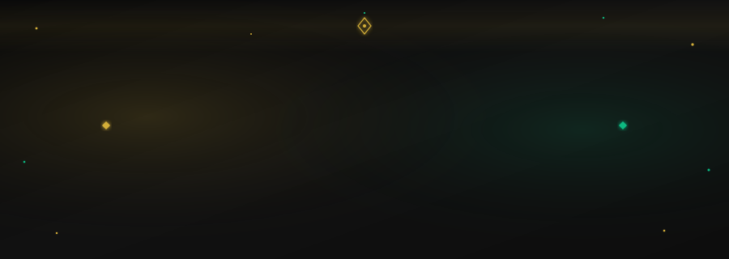
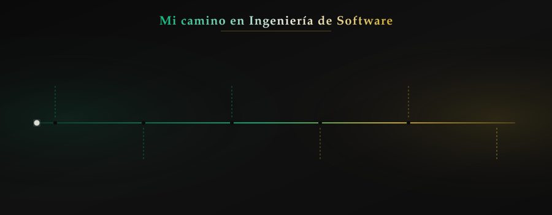

<div align="center">



<br/>


<br/>


<br/><br/>

<!-- Navegación -->
<a href="#-sobre-mí-"></a>
<a href="#-tech-stack-"></a>
<a href="#-proyectos-destacados-"></a>
<a href="#-roadmap-"></a>
<a href="#-certificaciones-"></a>

<br/>

<!-- Demos en vivo -->
<a href="https://fintu-co.pages.dev/"></a>
<a href="https://sanuvi-minsa.github.io/ferova-landing-page/"></a>

</div>

---

<div align="center"><h3><code>{ Sobre Mí }</code></h3></div>

```typescript
const sebastian: Developer = {
  nombre:      "Sebastian Pariachi Limahuaya",
  ubicacion:   "Lima, Perú 🇵🇪",
  universidad: "UPC — Ingeniería de Software (7.° ciclo)",
  ranking:     "🏆 Décimo superior (Top 10%)",
  objetivo:    "💼 Prácticas pre-profesionales",
  contacto: {
    email:    "sebastianpariachi.l@gmail.com",
    github:   "https://github.com/SebastianLima-PE",
    linkedin: "https://linkedin.com/in/sebastian-pariachi-limahuaya-4974b0377",
  },
  web:       ["React", "TypeScript", "Node.js", "Express", "MySQL", "MongoDB"],
  movil:     ["Kotlin (Android nativo)", "Flutter", "Swift"],
  practicas: ["DDD", "Arquitectura por capas", "SCRUM", "CI/CD"],
  idiomas:   { español: "Nativo", inglés: "Intermedio", français: "Básico" },
  motto:     "Build → Learn → Iterate → Repeat 🔁"
};
```

<div align="center">


</div>

---

### 🎯 En qué trabajo

- 🔭 Construyendo apps web **Full Stack** de producción
- 📱 Desarrollando apps móviles **nativas (Kotlin/Android)** y **multiplataforma (Flutter)**
- 🛠️ Diseñando **APIs RESTful** escalables, documentadas con **Swagger**
- 🔐 Implementando **autenticación JWT** + cifrado bcrypt
- 🗄️ Modelando bases de datos **SQL & NoSQL** optimizadas
- 💰 Integrando pasarelas de pago (**PayPal API**)
- 🚀 Automatizando **CI/CD con GitHub Actions** + deploy en **Cloudflare Pages** y **Vercel**
- 🧭 Aplicando **DDD**, arquitectura por capas y **SCRUM**

### 📬 Contáctame

<a href="mailto:sebastianpariachi.l@gmail.com?subject=Oportunidad%20de%20pr%C3%A1cticas"></a>
<a href="https://linkedin.com/in/sebastian-pariachi-limahuaya-4974b0377"></a>
<a href="https://github.com/SebastianLima-PE"></a>

---

<div align="center">
<h3><code>{ Tech Stack }</code></h3>

**📱 Móvil**


**⚡ Frontend**


**⚙️ Backend**


**🗄️ Bases de Datos**


**🔧 DevOps & Herramientas**


</div>

---

<div align="center"><h3><code>{ Proyectos Destacados }</code></h3></div>

### 🩺 Ferova — Ecosistema móvil contra la anemia infantil

<div align="center">

<a href="https://sanuvi-minsa.github.io/ferova-landing-page/"></a>


</div>

> *"Vence la anemia con cada dosis"* — Sistema de **dos aplicaciones móviles conectadas** para el tratamiento de la anemia infantil, diseñado para implementarse en las instalaciones de salud del **MINSA**. Desarrollado bajo la marca **Sanuvi** (Salud Digital en el Perú), en colaboración con puestos de salud del MINSA y la UPC.

**📱 Ferova Family** — Kotlin, Android nativo · *app para madres y apoderados*
- Registro y confirmación diaria de dosis con recordatorios inteligentes
- Diario nutricional con cálculo de absorción de hierro
- **Gamificación**: rachas, insignias y logros para sostener la adherencia
- Teleconsulta con la enfermera asignada + mapa de centros de salud cercanos

**🏥 Ferova Clinic** — Flutter · *app para el personal de salud*
- Panel de pacientes con **semáforo de riesgo**
- **Score de predicción de abandono** del tratamiento
- Registro y seguimiento de controles de hemoglobina en tiempo real

**🔄 Backend** — TypeScript con **API REST documentada en Swagger**, que sincroniza los datos entre la familia y el personal médico.

     

---

### 💳 FinTú & Co. — SaaS de gestión de tarjetas de crédito

<div align="center">

<a href="https://fintu-co.pages.dev/"></a>


</div>

> Aplicación web **SaaS** para la gestión y el análisis del uso de tarjetas de crédito, orientada al **mercado peruano**. Proyecto personal de punta a punta: del modelado de datos al despliegue automatizado.

- 🛠️ **API RESTful** (Node.js + Express) con módulos de usuarios, tarjetas y transacciones
- 🔐 Autenticación con **JWT** + cifrado **bcrypt**; MySQL optimizada para **datos financieros**
- ⚛️ Interfaz **React** responsive con React Router y navegación dinámica
- 💰 Integración de **PayPal** para suscripciones y monetización automática
- 🚀 **CI/CD con GitHub Actions** en cada push a `main` + deploy en **Cloudflare Pages**

       

---

<div align="center">

<h3><code>{ Roadmap }</code></h3>



</div>

---

<div align="center">
<h3><code>{ Certificaciones }</code></h3>

| 📜 Certificación | 🏛️ Institución | 📅 Fecha |
|---|---|---|
| **Power BI Intensivo** | IDAT · Intercorp | Feb – Mar 2026 |
| **Google IT Support Professional Certificate** | Google · Coursera | Mar – Abr 2026 |
| **Especialización Python for Everybody** | University of Michigan · Coursera | Abr – May 2026 |
| **Fundamentals of Machine Learning & AI** | AWS Training & Certification | Jun – Jul 2026 |

</div>

---

<div align="center">
<h3><code>{ Actividad }</code> 📈</h3>


</div>

---

<div align="center">
<h3><code>{ Contribution Snake }</code> 🐍</h3>

<picture>
  <source media="(prefers-color-scheme: dark)" srcset="https://raw.githubusercontent.com/SebastianLima-PE/SebastianLima-PE/output/github-contribution-grid-snake-dark.svg"/>
  <source media="(prefers-color-scheme: light)" srcset="https://raw.githubusercontent.com/SebastianLima-PE/SebastianLima-PE/output/github-contribution-grid-snake.svg"/>
  
</picture>

</div>

---

<div align="center">
<h3><code>{ Idiomas }</code> 🌐</h3>

<table>
<tr>
<td align="center" width="200">🇪🇸 <b>Español</b><br/><sub>Nativo</sub><br/>████████████ 100%</td>
<td align="center" width="200">🇺🇸 <b>English</b><br/><sub>Intermedio</sub><br/>████████░░░░ 70%</td>
<td align="center" width="200">🇫🇷 <b>Français</b><br/><sub>Básico</sub><br/>███░░░░░░░░░ 20%</td>
</tr>
</table>

<br/>


⭐ **Si algo de mi trabajo te fue útil, ¡dale una estrella!**

</div>
