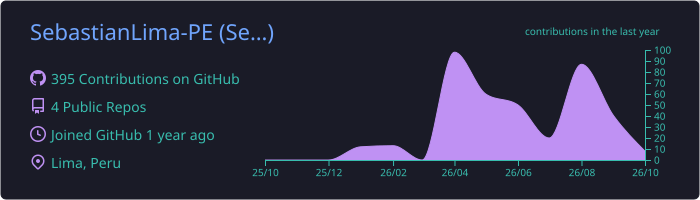
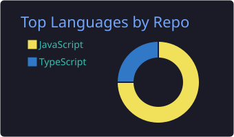
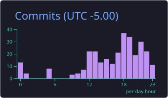
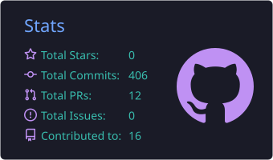
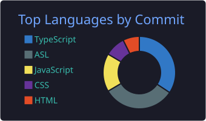

<div align="center">



</div>

## 🎯 Sobre mí

<table>
<tr>
<td width="55%" valign="top">

```javascript
const sebastian = {
  role:     "Ing. de Software @ UPC",
  ciclo:    "7.° ciclo · Top 10%",
  location: "Lima, Perú",
  busca:    "Prácticas pre-profesionales",

  building: [
    "Ferova (MINSA)",
    "FinTú & Co. (SaaS)",
  ],

  learning: [
    "Machine Learning (AWS · IBM)",
    "Swift / iOS",
    "System Design",
  ],

  tech: {
    frontend: ["React", "Next.js", "TS"],
    mobile:   ["Kotlin", "Flutter", "Swift"],
    backend:  ["Node.js", "Express", "Spring"],
    database: ["MySQL", "MongoDB"],
  },
};
```

> *"Primero, resuelve el problema. Después, escribe el código."*
>
> <sub>— John Johnson</sub>

</td>
<td width="45%" valign="middle" align="center">



</td>
</tr>
</table>

## 📫 Conecta conmigo

<div align="center">

<a href="https://linkedin.com/in/sebastian-pariachi-limahuaya-4974b0377"></a>
<a href="mailto:sebastianpariachi.l@gmail.com?subject=Oportunidad%20de%20pr%C3%A1cticas"></a>
<a href="https://portfoliop-three.vercel.app/"></a>
<a href="https://fintu-co.pages.dev/"></a>
<a href="https://sanuvi-minsa.github.io/ferova-landing-page/"></a>

</div>

## 🛠️ Tech Stack

<div align="center">


<br/>

<br/>


<br/><br/>


<br/>


</div>

## 🚀 Proyectos destacados

<table>
<tr>
<td width="50%" valign="top">

### 🩺 Ferova
<sub>Mar – Jul 2026 · Proyecto en equipo (5 devs) · Desarrollo móvil</sub>

Dos **apps móviles conectadas** contra la anemia infantil, pensadas para los establecimientos del **MINSA** (marca *Sanuvi*).

**Mi aporte:**
- 🚀 Inicié **Ferova Family** (Kotlin) y armé sus módulos base
- 🗺️ Mapa de centros de salud con **OSMDroid**
- 🏅 Logros y gamificación, diario nutricional con **absorción de hierro**
- 🏥 En **Ferova Clinic** (Flutter): panel de administración con analítica, vista de riesgo y citas en tiempo casi real

<a href="https://sanuvi-minsa.github.io/ferova-landing-page/"></a>

</td>
<td width="50%" valign="top">

### 💳 FinTú & Co.
<sub>Ene – Jul 2026 · Proyecto personal · Frontend en vivo</sub>

**SaaS** para gestionar y analizar tarjetas de crédito en el **mercado peruano**, de punta a punta.

- 🛠️ API REST con Node.js + Express + MySQL, arquitectura **DDD** por módulos
- 🔐 **JWT** + bcrypt, datos financieros protegidos
- 💰 Pago único con **PayPal**, verificado en el backend
- ✅ **CI** con GitHub Actions (29 tests) + deploy en Cloudflare Pages

<a href="https://fintu-co.pages.dev/"></a>

</td>
</tr>
</table>

## 📜 Certificaciones

<div align="center">

| 📜 Certificación | 🏛️ Institución | 📅 Fecha |
|---|---|---|
| **Data Analytics for Machine Learning** | IBM SkillsBuild | Sep 2026 |
| **SQL (Advanced) Certificate** | HackerRank | Ago 2026 |
| **Fundamentals of Machine Learning & AI** | AWS Training & Certification | Jul 2026 |
| **Especialización Python for Everybody** | University of Michigan · Coursera | Abr – Jun 2026 |
| **Prompt Design in Vertex AI** | Google Cloud | Abr – May 2026 |
| **Google IT Support Professional Certificate** | Google · Coursera | Mar – Abr 2026 |
| **Power BI Intensivo** | IDAT · Intercorp | Feb – Mar 2026 |

</div>

## 📊 GitHub Analytics

<div align="center">









</div>

## 🏆 GitHub Trophies

<div align="center">

</div>

## 🐍 Contribution Snake

<div align="center">
<picture>
  <source media="(prefers-color-scheme: dark)" srcset="https://raw.githubusercontent.com/SebastianLima-PE/SebastianLima-PE/output/github-contribution-grid-snake-dark.svg"/>
  <source media="(prefers-color-scheme: light)" srcset="https://raw.githubusercontent.com/SebastianLima-PE/SebastianLima-PE/output/github-contribution-grid-snake.svg"/>
  
</picture>
</div>

<div align="center">

<br/>

🇪🇸 **Español** · Nativo &nbsp;|&nbsp; 🇺🇸 **English** · Intermedio &nbsp;|&nbsp; 🇫🇷 **Français** · Básico


</div>
